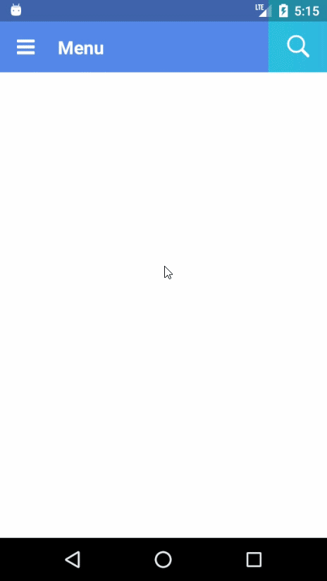

# react-native-jellytoolbar
[]()
[](https://www.npmjs.com/package/react-native-jellytoolbar)

React Native component for creating jelly-like toolbar.  
Inspired by [Yalantis' JellyToolbar](https://github.com/Yalantis/JellyToolbar) with Kotlin.

## Installation
1. Install this library and `react-native-svg`.
```
npm install react-native-jellytoolbar react-native-svg --save
```
2. Link `react-native-svg` with native code.
```
react-native link react-native-svg
```
For more information about `react-native-svg`, check [this repository](https://github.com/react-native-community/react-native-svg).

## Usage
1. Import JellyToolbar:  
```js
import JellyToolbar from 'react-native-jellytoolbar';
```
2. Use as follows:  
``` jsx
<JellyToolbar
  isStatusBarTranslucent = {true}
  height = {80}
  tabWidth = {64}
  primaryColor = '#5B86E5'
  secondaryColor = '#36D1DC'
  headerText = {'Menu'}
  headerTextSize = {20}
  placeholder = {'Search'}
  inputTextSize = {20}
  menuIcon={<Icon.../>}
  openTabIcon={<Icon.../>}
  closeTabIcon={<Icon.../>}
/>
```


## Properties
| Prop |Type| <Center>Description</Center> | Default | Required |
|:---:|:---:|---|:---:|:---:|
|**`isStatusBarTranslucent`**|`boolean`|**Note: For Android**<br> Whether StatusBar is translucent or not|`false`||
|**`height`**|`number`|Height of toolbar.<br> If you set `isStatusBarTranslucent = {true}`, this value should contain height of StatusBar. |*None*|**O**|
|**`tabWidth`**|`number`|Width of views that contain menuIcon, openTabIcon and closeTabIcon|*None*|**O**|
|**`primaryColor`**|`string`|Color of header and final color of searchbar gradient|*None*|**O**|
|**`secondaryColor`**|`string`|Initial Color of searchbar gradient|*None*|**O**|
|**`headerText`**|`string`|Text used in header section|`Header Text`||
|**`headerTextSize`**|`number`|fontSize of **`hederText`**|*None*|**O**|
|**`placeholder`**|`string`|Text used as placeholder of textinput|`Search...`||
|**`inputTextSize`**|`number`|fontSize of **`placeholder`** and typed text|*None*|**O**|
|**`menuIcon`**|`element`|Component used in menu section(left side of header)|*None*||
|**`openTabIcon`**|`element`|Component used in open tab|*None*||
|**`closeTabIcon`**|`element`|Component used in close tab|*None*|||

## License
MIT
